# Workshop React-Native @Becode Charleroi

## Sommaire
1. [Présentation](#présentation)
2. [Qu'est-ce que Réact Native?](#quest-ce-que-réact-native)
3. [Quelles sont les différences avec React?](#quelles-sont-les-différences-avec-react)
4. [Les mots clés important](#les-mots-clés-important)
5. [Créer une première application React Native](#créer-une-première-application-react-native)
    1. [Les installations nécessaire](#les-installations-nécessaire)
    2. [Initialiser le projet](#initialiser-le-projet)
6. [Exercices](#exercices)
    1. [Faire une application "Make your choice" (Livecoding)](#faire-une-application-make-your-choice-Livecoding)
    2. [Faire une application "Simon says"](#faire-une-application-simon-says)
7. [La documentation](#la-documentation)


## Présentation

Ce workshop est réalisé dans le cadre de la formation Becode à Charleroi. Le sujet a été choisi pour compléter le parcours React qui a été réaliser. Ce workshop est présenté par Maxime Huet et Adrien Desart. 

## Qu'est-ce que Réact Native?

React Native est basé sur la bibliothèque React et utilise donc du JavaScript. RN ("React Native") permet de construire de véritables applications mobile (IOS et Android), qui ne sont pas des applications web mobile, en n'utilisant que JS (à la place de Swift,Kotlin ou Java). Comme pour React, il utilise des components pour composer un environnement UI très riche et dynamique. 

RN permet d'utiliser et de modifier du code natif pour votre application. Vous pouvez combiner avec des components écrits en Swift,Java ou Objective-C. Cette combinaison permet d'optimiser les applications et de réaliser des tâches pas toujours réalisable en JS.

## Quelles sont les différences avec React? 

* RN est un framework mobile (React = bibliothèque JS) compilant les composants d'applications natifs.

* RN ne communique pas directement avec le DOM, il passe par bridge qui interprète les actions sur les différentes vues. RN utilise des composants créés par le développeur à partir des composants de base ("View, Text,...) pour créer du code natif.

## Les mots clés important:

`Text` : Un composant pour afficher du texte.

`View` : Le composant le plus fondamental pour la construction d'une interface utilisateur.

`Image` : Un composant pour afficher des images.

`ScrollView` : Fournit un conteneur de défilement pouvant héberger plusieurs composants et vues.

`TextInput` : Un composant pour la saisie de texte dans l'application via un clavier.

`StyleSheet` : Fournit une couche d'abstraction similaire aux feuilles de style CSS.


## Créer une première application React Native
### Les installations nécessaire:

- Dans un premier temps nous allons vérifier si node est à jour "8+", installer expo et créer un dossier appelé AwesomePorject et ce placer dans le dossier grâce aux commande: 

  ```npm install expo-cli --global```: expo est une chaîne d'outil construit autour de react native sans devoir utiliser android studio ou Xcode.

	```expo init AwesomeProject``` 

	```cd AwesomeProject```

- Nous allons ensuite lancer notre app

	```expo start``` : permet de lancer directement son app


## Exercices:

### Faire une application "Carte d'identité" (Livecoding)

### Faire une application "Simon says"

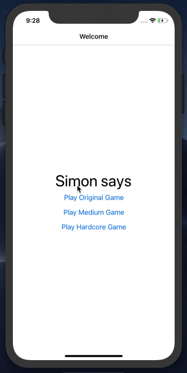

**Présentation de l'exercice:** 

La tâche qui vous est proposée ici est de réaliser le célèbre jeu "Simon says". Pour ce faire je vous propose de réaliser par vous même les différentes scènes que je vous soumets. En plus de cela, je met à votre disposition le code détaillé de l'application si vous pensez être perdu. Bonne chance! 

1. Réalise un component d'acceuil "Welcome" 

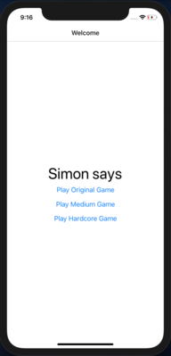

2. Réalise les routes de ton app avec react-native-router dans le fichier App.js

3. Réalise un component "Game" contenant: 

    * Une classe "Game" qui sera le rendu du jeu avec l'affichage du score, du best score, d'un bouton play et des cases de couleurs.

    * Une fonction _RenderTiles et une autre _RederTile qui vont créer les 4 cases de couleurs.

    * Une fonction _PlayColor qui "jouera" les couleurs déterminées par le jeu.

    * Une fonction _PlayTheGame qui comparera les réponses entrée par le joueur avec la solution.

    * Une fonction _ResetTheGame qui agira au clic du bouton play pour lancer la partie et la réinitialiser (sans réinitialiser le best score évidement).

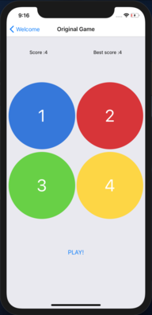

4. Défi supplémentaires: 

    * Ajouter du son sur les cases de couleurs

    * Créer un mode de jeu "médium" et "hardcore" qui change les couleurs énumérées à chaque tour de jeu.

*Astuce* : Je te conseil de faire un tableau dans lequel tu vas stocker les couleurs énumérée par le jeu et un tableau qui va accepter les entrées du joueurs. Compare ensuite ces deux tableaux pour savoir si le jeu est gagné ou pas.

**_Détail du code:_**

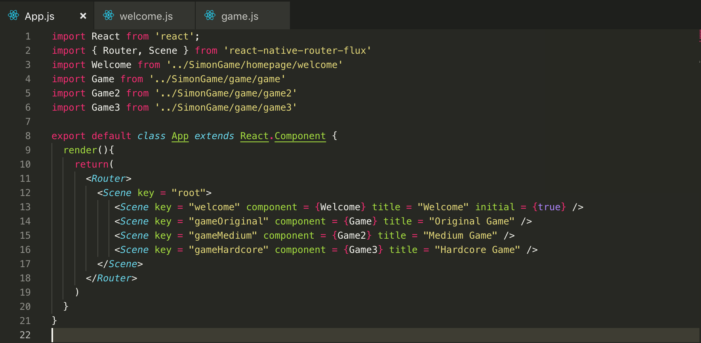

Relativement simple, ce code permet de créer les "Routes" de notre application et de décider les différentes scènes de notre application. `initial = {true}` détermine la page d'accueil par définition. 

---

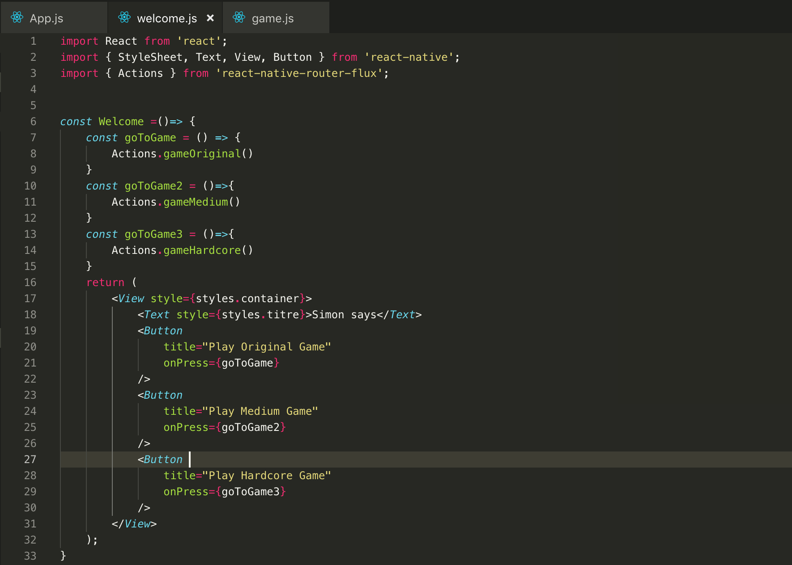

Le component Welcome est un component stateless, dans celui-ci nous allons mettre nos boutons qui vont rediriger l'utilisateur vers les différents modes de jeu. `Actions` permet la redirection vers la route. 

---

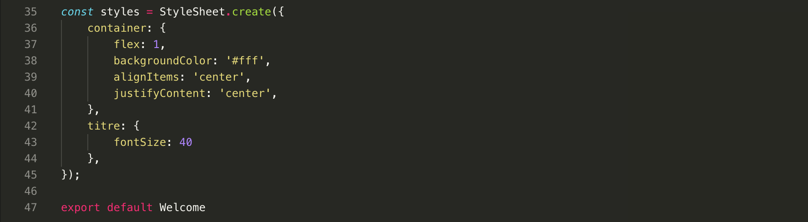

Nous y ajoutons un peu de style et de forme afin de rendre ca visuelement plus sympa.

---

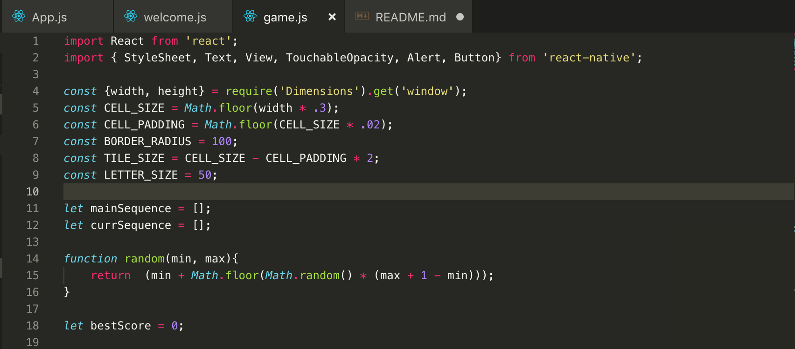

Les différentes variables que vous voyez ici sont utiliser afin de simplifier la rédaction et la mise en place du style. Seul `mainSequence` et `currSequence` sont réellement utilile.

---

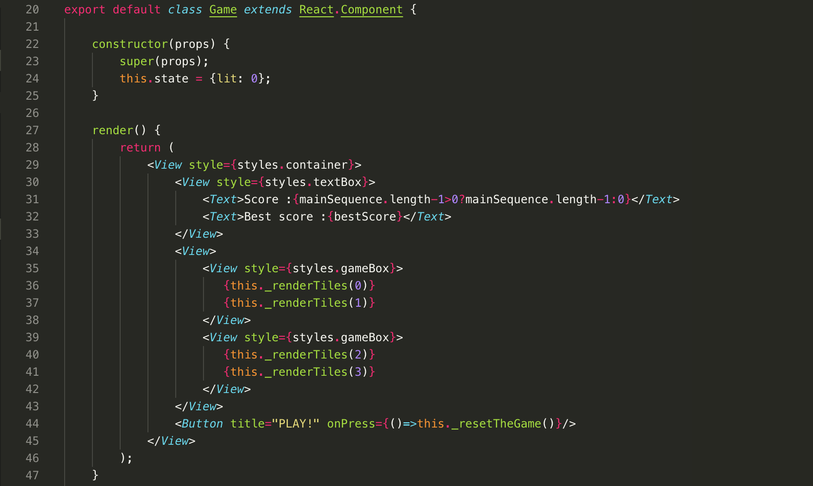

On crée ici notre component avec un state. Ce state `lit` représente l'id de la couleur à "éclairer" à un moment donné.

Pour le reste, rien de très compliqué...

---

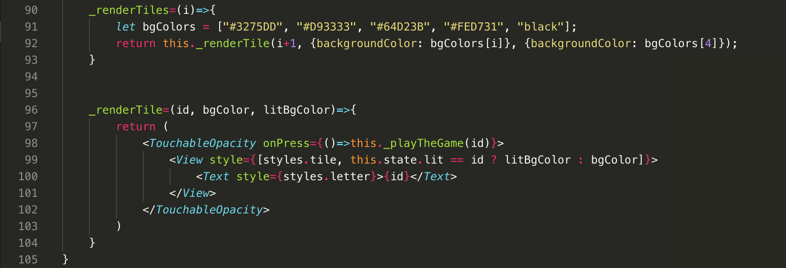

Ici nous avons les deux fonctions qui vont créer les boutons avec leur propre couleur et leur données. C'est ici aussi que nous allons gérer (avec le state) "l'allumage" des boutons.

---

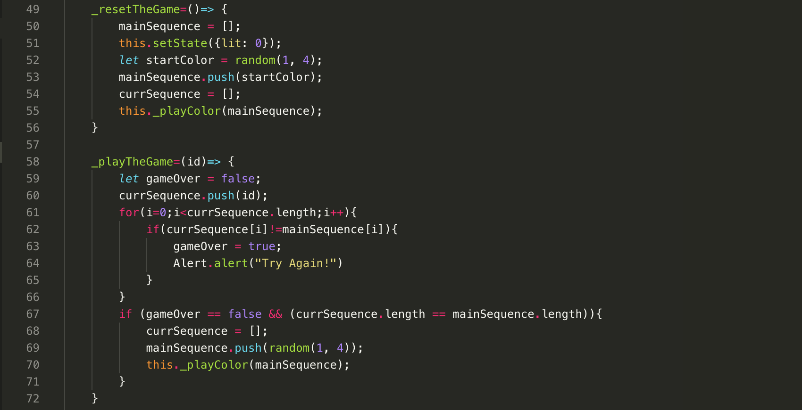
 
La fonction `_resetTheGame` sert comme son nom l'indique à relancer la partie de zéro. On appelle cette fonction dans le boutton play du `render`

La fonction `_playTheGame` quant à elle, va  comparer dans nos tableaus de jeux les cases qui se sont éclairée et celles sur lesquelles nous avons appuyés. 

---

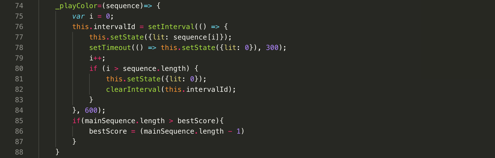

La fonction `_playColor` joue la partition de couleur et en profite pour écrire le `bestScore`.

---

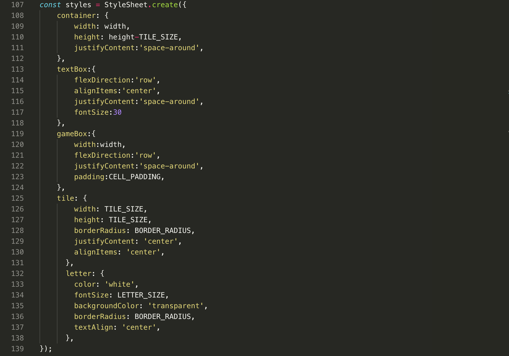

Pour terminer, nous ajoutons du style à notre application afin de la rendre plus agréable.

## La documentation:

[La documentation officielle de facebook](https://facebook.github.io/react-native/)

[Le github de React Native](https://github.com/facebook/react-native)

[Document de l'installation](https://docs.nativebase.io/docs/GetStarted.html)